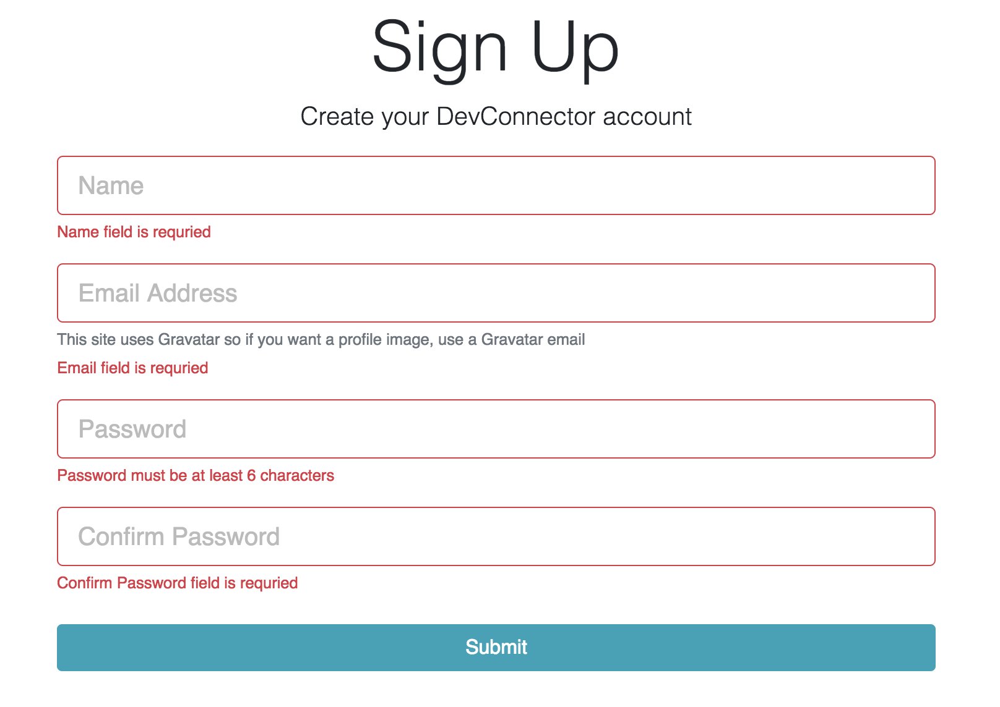
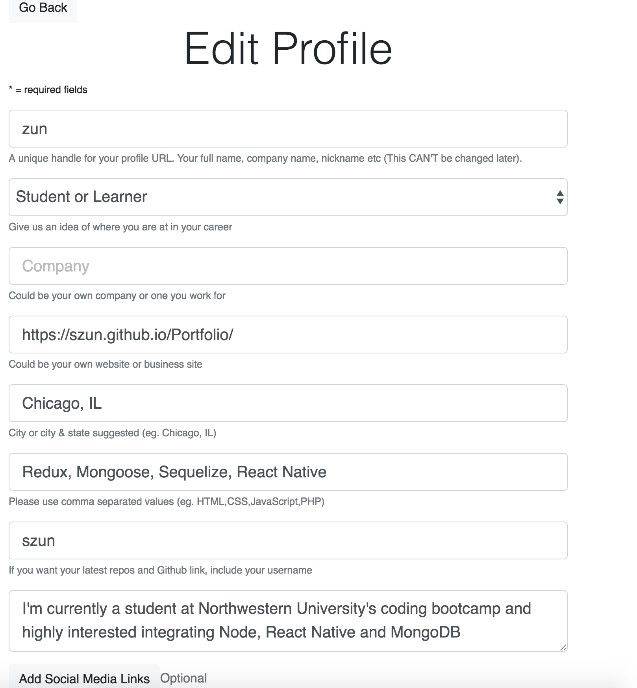
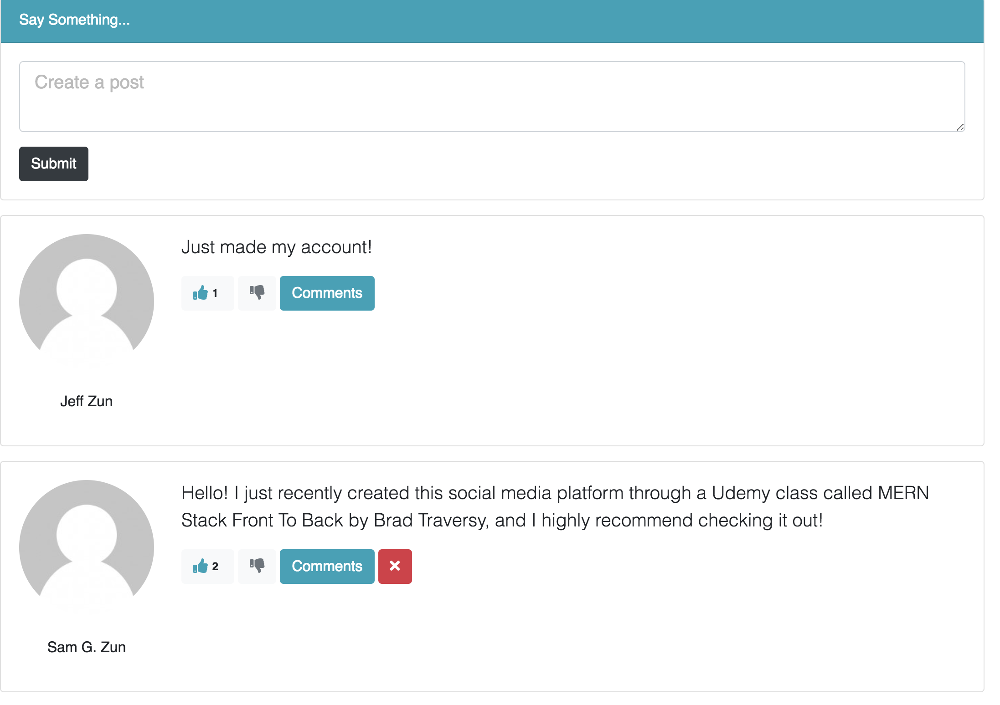

# DevConnector

A social media application designed to connect software developers. This application allows users to display their experience and education as well as create, comment and like posts.

## [Deployed Here](https://sleepy-cove-35335.herokuapp.com/)







## Getting Started

### Prerequisites

Installing Create-React-App and the latest versions of NPM and Node.

```
$ npm i -g create-react-app@latest
$ npm i -g node@latest
$ npm i -g npm@latest
```

### Installing

After cloning the repo, cd into the directory and install the required npm packages:

```
npm i
```

## Deployment

```
heroku login
heroku create
git add -A
git commit -m "heroku deployment"
git push heroku master
```

## Built With

- [ReactJS](https://reactjs.org/) - The web framework used
- [React Router](https://www.npmjs.com/package/react-router-dom) - Router allowing for single page applications
- [Redux](https://redux.js.org/) - Used for state management
- [Redux Thunk](https://github.com/reduxjs/redux-thunk) - Used for asynchronous state management
- [Axios](https://www.npmjs.com/package/axios) - Used for HTTP Requestsdeployment
- [Redux Form](https://redux-form.com/7.4.2/) - Used for wizard form
- [Node.js](https://nodejs.org/en/) - Backend
- [Mongoose](https://mongoosejs.com/) - Database ODM
- [Express](https://expressjs.com/) - Node.js Framwork
- [Body-Parser](https://www.npmjs.com/package/body-parser) - Middleware
- [Passport](http://www.passportjs.org/) - Authentication/Authorization Middleware
- [Passport-JWT](https://github.com/themikenicholson/passport-jwt) - Authenticaiton through JSON web token
- [Bcrypt.js](https://www.npmjs.com/package/bcryptjs) - Password Hashing
- [Bootstrap 4](https://getbootstrap.com/docs/4.0/getting-started/introduction/) - CSS Framework
- [Validator](https://www.npmjs.com/package/validator) - Custom Validation
- [React Moment](https://www.npmjs.com/package/react-moment) - Date Parsing
- [Gravatar](https://en.gravatar.com/) - Profile Image Manager
- [Github API](https://developer.github.com/v3/) - Profile Image Manager

## Authors

- **Sam G Zun** - [SZun](https://github.com/SZun)
